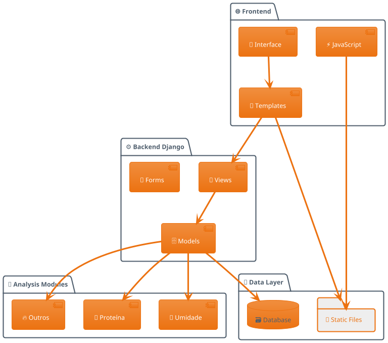

# 🎨 Gerador de Imagem da Arquitetura

Este script pode ser usado para gerar uma imagem visual da arquitetura do sistema QualiSoja.

## 📋 Opções Disponíveis

### 1. Usar Mermaid CLI (Recomendado)
```bash
# Instalar mermaid-cli
npm install -g @mermaid-js/mermaid-cli

# Criar arquivo mermaid
cat > arquitetura.mmd << EOF
graph TB
    subgraph "🌐 Frontend"
        UI[👤 Interface do Usuário<br/>Bootstrap + JavaScript]
        TPL[📄 Templates Django<br/>HTML/CSS]
    end
    
    subgraph "⚙️ Backend Django"
        URLS[🔗 URLs Router]
        VIEWS[🎯 Views/Controllers<br/>Análises, Relatórios, Auth]
        FORMS[📝 Forms & Validações]
        MODELS[🗄️ Models<br/>7 Tipos de Análises]
    end
    
    subgraph "💾 Persistência"
        DB[(🗃️ Banco de Dados<br/>SQLite/PostgreSQL)]
        STATIC[📁 Arquivos Estáticos<br/>CSS, JS, Imagens]
    end
    
    subgraph "🔬 Módulos de Análise"
        UMIDADE[🌊 Umidade<br/>4 casas decimais]
        PROTEINA[🥩 Proteína<br/>FP/SA Support]
        OUTROS[... Outras 6 Análises<br/>Todas com FP/SA]
    end
    
    UI --> TPL
    TPL --> VIEWS
    VIEWS --> FORMS
    VIEWS --> MODELS
    MODELS --> DB
    
    MODELS --> UMIDADE
    MODELS --> PROTEINA
    MODELS --> OUTROS
    
    TPL --> STATIC
EOF

# Gerar imagem
mmdc -i arquitetura.mmd -o arquitetura.png -t dark -b transparent
```

### 2. Usar Draw.io / Diagrams.net
1. Acesse https://app.diagrams.net/
2. Crie um novo diagrama
3. Use os elementos do arquivo `arquitetura-template.xml` (criar)

### 3. Usar Python + Graphviz
```python
# pip install graphviz
from graphviz import Digraph

def criar_arquitetura():
    dot = Digraph(comment='QualiSoja Architecture')
    dot.attr(rankdir='TB', size='10,8')
    
    # Frontend
    with dot.subgraph(name='cluster_frontend') as c:
        c.attr(style='filled', color='lightblue', label='🌐 Frontend')
        c.node('UI', '👤 Interface\nBootstrap + JS')
        c.node('TPL', '📄 Templates\nDjango')
    
    # Backend
    with dot.subgraph(name='cluster_backend') as c:
        c.attr(style='filled', color='lightgreen', label='⚙️ Backend Django')
        c.node('VIEWS', '🎯 Views\nControllers')
        c.node('MODELS', '🗄️ Models\n7 Análises')
    
    # Database
    with dot.subgraph(name='cluster_data') as c:
        c.attr(style='filled', color='lightyellow', label='💾 Dados')
        c.node('DB', '🗃️ Database\nSQLite/PostgreSQL')
    
    # Connections
    dot.edge('UI', 'TPL')
    dot.edge('TPL', 'VIEWS')
    dot.edge('VIEWS', 'MODELS')
    dot.edge('MODELS', 'DB')
    
    return dot

# Gerar
arch = criar_arquitetura()
arch.render('docs/images/arquitetura', format='png', cleanup=True)
```

### 4. Usar PlantUML


## 🚀 Como Usar

1. Escolha uma das opções acima
2. Execute o comando/script correspondente
3. A imagem será gerada em `docs/images/`
4. Atualize o README.md com o link da imagem

## 📝 Notas

- O diagrama ASCII atual já é bem visual e funcional
- Uma imagem PNG pode ser útil para documentação externa
- Considere manter ambos (ASCII para README, PNG para docs)
